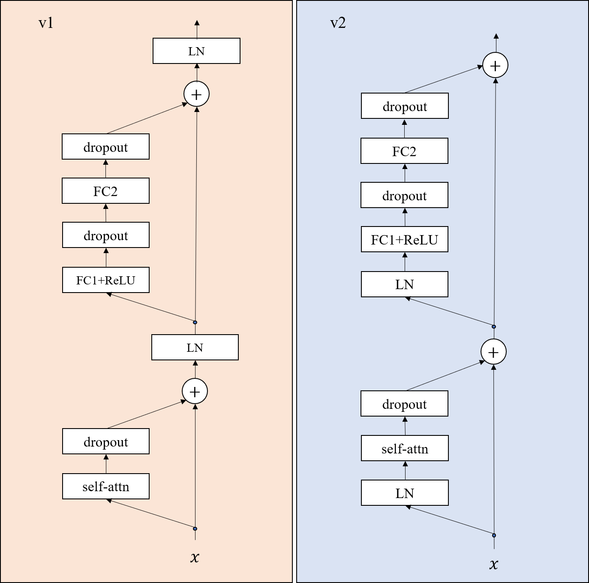

# An introduction of Transformer

## Problem Formulation
There are two domains $\mathcal{X}$ and $\mathcal{Y}$. The goal of NMT is to learn a mapping $f:\mathcal{X}\mapsto\mathcal{Y}$. For each $x\in\mathcal{X}$, $x$ can be represented as $(x_1,x_2,\cdots,x_{T_x})$, where $x_i$ is the $i$th word in $x$, $T_x$ is the length of $x$. Similarly, any $y\in\mathcal{Y}$ can be denoted as $(y_1,y_2,\cdots,y_{T_y})$.

## Basic Architecture
Most NMT systems adopt the structure of the encoder-decoder framework, where the input sequence is firstly processed by the encoder $\varphi_E$ to get hidden representations; then the obtained representations are fed into the decoder $\varphi_D$ to acquire the output in $\mathcal{Y}$. $\varphi_E$ and $\varphi_D$ can be specialized using different neural architectures like GRU, LSTM, CNN, Transformer, etc. Suppose there are $L$ stacked layers in both encoder and decoder. For ease of statement, let $\varphi_E$ and $\varphi_D$ respectively denote the concatenations of the representations from all the $L$ encoder layers and decoder layers.  The representations from the $l$th layer of the encoder and the decoder are denoted as $\varphi^l_E$and $\varphi^l_D$. With these notations, we turn to introduce the details of Transformer.

 
## Attention Model
The core component of the Transformer is the attention module $\varphi_A(q,K,V)$, where $q\in\mathbb{R}^d$;  $K$ consists of $\vert K\vert$ elements $(k_1,k_2,\cdots,k_{\vert K\vert})$ with $k_i\in\mathbb{R}^d$; $V$ consists of $\vert V\vert$ elements $(v_1,v_2,\cdots,v_{\vert V\vert})$ with $v_i\in\mathbb{R}^d$. Usually, $\vert K\vert=\vert V\vert$. Mathematically,  
\begin{equation} 
\varphi_A(q,K,V)=\sum_{i=1}^{\vert V\vert}\alpha_iW_vv_i;\;\alpha_i\propto \exp(W_qq+W_kk_i), 
\end{equation} 
where $\alpha_i\ge0$, $\sum_{i=1}^{\vert V\vert}\alpha_i=1$, and $W$'s are the parameters to be learned.  

## Encoder
An input $x\in\mathcal{X}$ is first mapped into a representation 
$$H^0=(h^0_1,h^0_2,\cdots,h^0_{T_x})$$ through embedding matrix.  We use $H^l$ to denote $(h^l_1,h^l_2,\cdots,h^l_{T_x})$ where the superscript $l\in\\{0,1,\cdots,L\\}$ represents the layer id with the $0$'th layer as the embedding layer, and $h_i\in\mathbb{R}^d$ for any $i\in[l_x]$. The encoder works in a recursive way that $$H^{l}=\varphi_E^{l}(H^{l-1}),l\in[L]$$. $\varphi^l$ consists of two sub-layers: 

  + a self-attention layer $F_S$ that provides an adaptive weighted sum of the hidden representations at each time step from the $l-1$'th layer. $F_s$ is implemented as $\varphi_A(\cdots)$ defined above.
  + a non-linear layer $F_N$ where $F_N(x)=\max(xW_1+b_1,0)W_2+b_2$, $\max$ is an element-wise operator, $W$'s and $b$'s are the parameters to be learned. Then, $\varphi_E^{l+1}=F_N(\varphi_A(h^l_i,H^l,H^l))$. $W_1\in\mathbb{R}^{d\times d_{ff}}$ and $W_2\in\mathbb{R}^{d_{ff}\times d}$. 
Mathematically, $\forall i\in[T_x]$,

\begin{equation}
\varphi^l_E(h^{l-1}_i,H^{l-1})=F_N(F_S(h^{l-1}_t,H^{l-1},H^{l-1})). 
\end{equation}
The encoder will eventually output $H^L$.

## Decoder
The decoder works in a similar way as the encoder with the only difference of leveraging an additional part to deal with the information from the encoder. Each layer in the decoder has three sub-layers: 

  + a self-attention layer $F_S$;
  + source-to-target attention layer $F_C$;
  + a non-linear layer $F_N$. 
  
Let $s^l_t$ denote the output of the $l$'th layer in the decoder at times-tep $t$($>0$) and let $S^l_t$ denote $(s^l_1,\cdots,s^l_t)$, $l\in[L]$. Specially, $S^0_t$ is the collection of the embeddings of $y$'s. Mathematically we have,  
\begin{equation} 
\varphi^l_D(s^{l-1}_t,S^{l-1}_t,H^L)=F_N(F_C(F_S(s^{l-1}_t,S^{l-1}_t,S^{l-1}_t),H^L,H^L)). 
\end{equation} 
Finally, $s^L_t$ will be fed into a softmax layer to get the probabilities for generating the words.

## Transformer v1 and Transformer v2
In the tensorflow and pytorch implementation, there are two different kinds of settings and denote them as v1 and v2 respectively. The picture below shows the differences of the encoders between v1 setting and v2 setting.

In this picture, 'self-attn' represents the self-attention, i.e., $F_S$; 'dropout' represents the dropout layer; 'LN' refers to layer normalization; FC1 and FC2 refers to two fully-connect layers; ReLU is the $\max(\cdot,0)$ operation.

+ For v1 setting, there is no shorcut that can link the input $x$ to the output;

+ For v2 setting, there exists a shorcut that can link the input $x$ to the output.

A similar example can be found in Figure 1 of the paper [Identity Mappings in Deep Residual Networks](https://arxiv.org/pdf/1603.05027.pdf).

